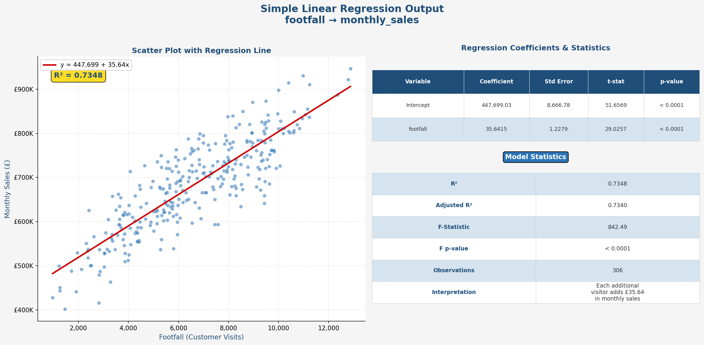
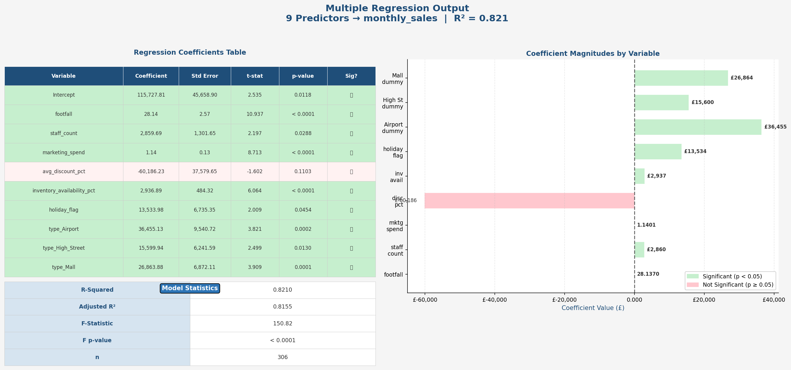
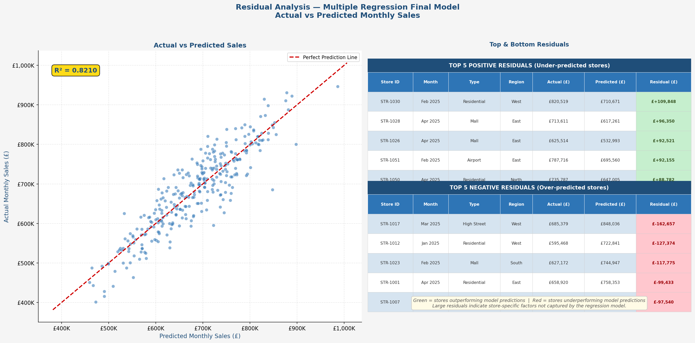
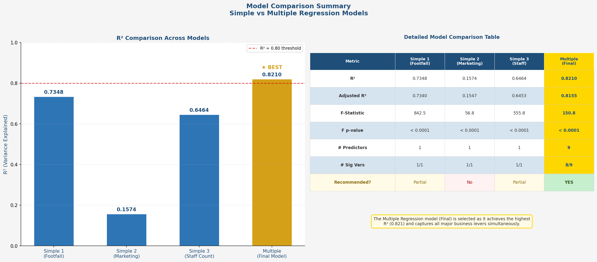

# Part 3: Regression-Based Business Insights & Model Interpretation

## Business Problem Summary

A retail chain leadership team wants to understand what drives monthly sales performance across stores. The goal is to identify which operational and contextual factors most strongly predict monthly sales, so that resources can be allocated and strategies optimised accordingly. Regression analysis is used to quantify these associations and support data-driven decision-making.

---

## Dataset Description

**File:** `data/business_regression_data.xlsx`  
**Sheet:** `store_performance`  
**Observations:** 320 rows (80 stores × 4 months: Jan–Apr 2025)  
**Missing values:** `competitor_distance_km` (6 missing), `customer_rating` (8 missing) — handled by listwise deletion for regression (final cleaned dataset: 306 rows)

| Column | Type | Description |
|---|---|---|
| store_id | Categorical (ID) | Unique store identifier |
| month | Date | Month of observation |
| region | Categorical | East, West, North, South |
| store_type | Categorical | Residential, High Street, Mall, Airport |
| marketing_spend | Numerical | Monthly marketing expenditure (£) |
| footfall | Numerical | Number of customer visits |
| avg_discount_pct | Numerical | Average discount applied (proportion) |
| staff_count | Numerical | Number of staff employed |
| inventory_availability_pct | Numerical | % of inventory available (stock fill rate) |
| competitor_distance_km | Numerical | Distance to nearest competitor (km) |
| holiday_flag | Binary (0/1) | Whether a holiday occurred that month |
| customer_rating | Numerical | Average customer satisfaction rating (1–5) |
| monthly_sales | **Dependent Variable** | Monthly sales revenue (£) |
| monthly_profit | Numerical | Monthly profit (excluded from regression) |

---

## Dependent and Independent Variables

**Dependent Variable:** `monthly_sales`

**Independent Variables used in regression:**
- `footfall` — strongest numerical predictor (r = 0.858)
- `staff_count` — second strongest (r = 0.808)
- `marketing_spend` — moderate predictor (r = 0.409)
- `avg_discount_pct` — weak negative correlation (r = -0.091)
- `inventory_availability_pct` — weak positive (r = 0.115)
- `holiday_flag` — mild positive (r = 0.195)
- Dummy variables for `store_type` (Airport, High Street, Mall vs. Residential reference)

**Variables excluded from regression:**
- `store_id` — identifier, not a predictor
- `month` — time variable; not used directly
- `region` — dummy variables tested but not significant after store_type included
- `customer_rating` — not statistically significant (p = 0.647 in simple regression)
- `competitor_distance_km` — not significant in preliminary testing
- `monthly_profit` — outcome variable, not a predictor of sales

---

## Regression Approach

1. **Simple Regression** — Two separate models: footfall and marketing_spend as individual predictors of monthly_sales.
2. **Multiple Regression** — One model combining: footfall, staff_count, marketing_spend, avg_discount_pct, inventory_availability_pct, holiday_flag, and store_type dummies.

---

## Dummy Variable Approach

Categorical variable encoded: `store_type`  
Reference category: **Residential** (dropped to avoid multicollinearity)

Dummies created:
- `type_Airport` (1 = Airport store, 0 = otherwise)
- `type_High_Street` (1 = High Street store, 0 = otherwise)
- `type_Mall` (1 = Mall store, 0 = otherwise)

Region dummies were also tested but were not statistically significant after controlling for store_type and operational variables.

---

## Model Comparison Summary

| Model | Variables | R² | Adjusted R² | Key Finding |
|---|---|---|---|---|
| Simple 1 | footfall | 0.7348 | 0.7340 | Very strong single predictor |
| Simple 2 | marketing_spend | 0.1574 | 0.1547 | Moderate predictor alone |
| Multiple | footfall + staff_count + marketing_spend + avg_discount_pct + inventory_availability_pct + holiday_flag + store_type dummies | 0.8210 | 0.8155 | Best overall model |

---

## Final Model Selected

**Multiple Regression Model** with 9 predictors:  
`monthly_sales = 115,728 + 28.14×footfall + 2,860×staff_count + 1.14×marketing_spend − 60,186×avg_discount_pct + 2,937×inventory_availability_pct + 13,534×holiday_flag + 36,455×type_Airport + 15,600×type_High_Street + 26,864×type_Mall`

**R² = 0.821** — the model explains 82.1% of variation in monthly sales.

---

## Business Recommendation

**Top factors to focus on:**
1. **Footfall** — the strongest driver. Leadership should invest in foot traffic strategies (location marketing, accessibility, events).
2. **Staff Count** — more staff associates with significantly higher sales. Adequate staffing levels matter.
3. **Marketing Spend** — each additional £1 in marketing spend is associated with £1.14 in additional sales.
4. **Inventory Availability** — keeping shelves stocked correlates with higher sales.
5. **Store Type** — Airport stores outperform Residential by ~£36,000/month on average; Mall stores by ~£27,000/month.

**Variables not to over-interpret:**
- `avg_discount_pct` — negative coefficient but not statistically significant (p = 0.11)
- `customer_rating` — shows no significant linear relationship with sales in this dataset
- `competitor_distance_km` — not a significant predictor

---

## Assumptions and Limitations

- Regression assumes linearity between predictors and monthly_sales — this may not fully hold.
- Only 4 months of data per store; seasonal patterns cannot be fully captured.
- Regression shows **association, not causation** — e.g., higher footfall may cause higher sales, but it could also be that high-sales stores attract more visitors.
- Multicollinearity possible between footfall and staff_count (stores with more footfall tend to staff more).
- 14 rows dropped due to missing values.
- Region dummies were not significant, which may reflect uneven store counts by region.

---

## Screenshots Included

| File | Content |
|---|---|
| `screenshots/simple_regression_output.png` | Simple regression: footfall → monthly_sales |
| `screenshots/multiple_regression_output.png` | Multiple regression output table |
| `screenshots/residuals_preview.png` | Top positive and negative residuals |
| `screenshots/model_comparison_preview.png` | Model comparison summary table |

